# AlphaSector: Autonomous Equity Research Agent for IDX

<div align="center">


**Institutional-Grade Autonomous Equity Research Terminal & Quantitative Alpha Agent for the Indonesian Capital Market (Bursa Efek Indonesia / IDX)**

[](https://sectors.app)
[-000000?style=for-the-badge&logo=next.js&logoColor=white)](https://nextjs.org/)
[](https://fastapi.tiangolo.com/)
[](https://python.org/)
[](https://www.typescriptlang.org/)
[](https://tailwindcss.com/)
[](https://sectors.app)
[-8B5CF6?style=for-the-badge&logoColor=white)](https://sectors.app)
[-F05A28?style=for-the-badge)](https://groq.com/)
[](https://aistudio.google.com/)
[](https://developers.notion.com/)
[](https://alphasector.vercel.app/)
[](LICENSE)

[🌐 **Deployed Application (Vercel)**](https://alphasector.vercel.app/) • [💻 **Local Terminal**](http://localhost:3000) • [🧭 **MCP Tools Catalog**](http://localhost:3000/mcp-tools) • [**Swagger API Docs**](http://localhost:8000/docs)

> 🚀 **Live Production Deployment**: AlphaSector is deployed and live at [**https://alphasector.vercel.app/**](https://alphasector.vercel.app/). Hackathon judges can test the full terminal immediately with 1-click instant demo access!

</div>

---

## 📑 Table of Contents
1. [Executive Summary](#-executive-summary)
2. [Track 01 Qualification Statement](#-track-01-qualification-statement)
3. [Architecture: Custom Agent vs Generic MCP Wrapper](#-architecture-custom-agent-vs-generic-mcp-wrapper)
4. [Sectors Model Context Protocol (MCP Engine) & Dual-Protocol Pipeline](#-sectors-model-context-protocol-mcp-engine--dual-protocol-pipeline)
5. [Completed Feature Navigation Index](#-completed-feature-navigation-index)
6. [Frictionless Local Run Guide (Zero-Config Bootup)](#-frictionless-local-run-guide-zero-config-bootup)
7. [Judge Usability & Zero-Friction Hardening (8 Curated Scenarios)](#-judge-usability--zero-friction-hardening-8-curated-scenarios)
8. [Deterministic Quantitative Finance Engine](#-deterministic-quantitative-finance-engine)
9. [Smart Money & Bandarmology Telemetry](#-smart-money--bandarmology-telemetry)
10. [Market News Intelligence & Bursa Caching Engine](#-market-news-intelligence--bursa-caching-engine)
11. [Institutional Notion Sync Pipeline](#-institutional-notion-sync-pipeline)
12. [Resilience, Multi-Tenant Session Isolation & Security Architecture](#-resilience-multi-tenant-session-isolation--security-architecture)
13. [Repository Hygiene & Code Freeze Compliance](#-repository-hygiene--code-freeze-compliance)
14. [Mandatory Financial Disclaimer & Regulatory Compliance](#-mandatory-financial-disclaimer--regulatory-compliance)

---

## 🏛 Executive Summary

The Indonesian Capital Market (Bursa Efek Indonesia / IDX) hosts over **900 publicly listed companies**. Yet, retail investors and professional analysts face a severe information asymmetry: financial disclosures are buried inside hundreds of dense, unstructured PDF reports, valuation ratios are calculated inconsistently by hand, and institutional accumulation (*"smart money"* flow) remains opaque to everyday market participants.

**AlphaSector** solves this structural problem by providing an institutional-grade, autonomous equity research terminal. Built on top of the official **Sectors Financial API v2**, AlphaSector bridges raw financial telemetry with rigorous decision-making:

- **Autonomous Multi-Step Agent Orchestrator**: Coordinates a 5-phase Directed Acyclic Graph (DAG) that decomposes natural language queries, dispatches parallel asynchronous tool executions, and generates structured Indonesian equity dossiers.
- **Sectors Model Context Protocol (MCP Engine)**: Full JSON-RPC 2.0 client implementation over SSE Streamable HTTP (`/api/mcp/`), dynamic 66-tool catalog discovery, live ping latency diagnostics, and specialized forensic tools (`fetch-filings`, `fetch-shareholders-composition`, `fetch-suspensions`, `fetch-mining-company-performance`).
- **Deterministic Quantitative Engine**: Bypasses LLM calculation hallucinations completely. Computes the complete **9-criteria Piotroski F-Score**, sample variance **P/E Historical Standard Deviation Bands**, and Benjamin Graham Fair Value using deterministic Python mathematics.
- **Trade Ideas Radar & 1-Click Screening**: 4 institutional-grade screening presets (`ESG Leaders IDX`, `Revenue Growth Titans`, `Large Single-Shareholder`, `Efficient Operators`) triggerable directly in `/screener` and the AlphaAgent research room.
- **Smart Money & Bandarmology Radar**: Tracks top institutional brokerage accumulation vs. distribution, net foreign flow trends, and institutional buyer concentration ratios in real time.
- **Multimodal Financial Vision Perception**: Integrates Google Gemini 2.5 Flash Vision to parse user-uploaded candlestick charts, RTI broker summaries, and balance sheet scans directly into the agent reasoning context.
- **1-Click Institutional Notion Sync**: Automatically structures valuation tables, catalysts, risks, and health scores into Wall Street-grade Notion investment memorandums.
- **Institutional Account Security & BYOK Architecture**: PBKDF2-HMAC-SHA256 password management (`/settings/password`), multi-tenant session & cache isolation, quota tracking, and an intelligent fresh login setup tooltip.
- **Dark Obsidian Financial Interface**: A high-craft Next.js 15 terminal UI engineered with Tailwind CSS v4, live thinking traces, side-by-side battle matrixes, and split-screen artifact drawers.

---

## 🎯 Track 01 Qualification Statement

### Compliance with Sectors Hackathon Track 01 Guidelines (`ai-track-guideline.md:9-28`)

> **The Qualifying Test**: *"The project must include custom-built agent logic or orchestration. The team must build something of its own around the model—not only connect an existing client to Sectors... An AI/LLM component is mandatory for this track."*
> 
> **What Qualifies**: Multi-step reasoning flows, custom tool-use pipelines, routing between data sources, memory or state management, autonomous task execution, and a purpose-built interface for a specific participant and problem.
> 
> **What Does NOT Qualify**: *"Connecting an off-the-shelf AI client such as Claude, OpenClaw, or Hermes to the Sectors MCP with custom prompts or configuration alone. If the product would disappear when the team's prompt is removed from someone else's client, it does not meet this track's bar."*

### Why AlphaSector Strictly Qualifies:

| Track 01 Criterion | AlphaSector Implementation Evidence | Codebase Reference |
|---|---|---|
| **Custom Multi-Step Reasoning** | 5-phase execution DAG: Multimodal Perception $\to$ Intent Arbitration $\to$ DAG Planning $\to$ Parallel Tool Fetching $\to$ Quant Math $\to$ Structured Bahasa Indonesia Synthesis. | `backend/app/agent/orchestrator.py`<br>`backend/app/agent/planner.py` |
| **Dual-Protocol Tool Pipeline** | Dual-engine dispatcher combining high-concurrency **REST API v2** (`asyncio.gather`) with **Sectors MCP JSON-RPC 2.0** (`sectors-mcp.supertype.ai`) for deep forensic tools, with live UI protocol switching. | `backend/app/agent/tools.py`<br>`backend/app/sectors/mcp_client.py` |
| **Data Routing & Synthesis** | Dynamically routes queries across company financials, subsector metrics, broker flows, foreign flows, and top movers based on intent classification. | `backend/app/agent/comparator.py`<br>`backend/app/api/sectors.py` |
| **Memory & State Management** | Persistent multi-turn research rooms, primary ticker bindings, contextual follow-up reasoning, and user authentication state. | `backend/app/api/chat.py`<br>`backend/app/db/database.py` |
| **Deterministic Math Rigor** | Full 9-point Piotroski F-Score calculation and historical P/E standard deviation bands executed purely in Python—never hallucinated by an LLM. | `backend/app/agent/financial_engine.py` |
| **Dual-Tier Credit Caching** | L1 In-Memory and L2 Database cache (24h TTL) saving Sectors API credits across repeated queries and peer battles. | `backend/app/sectors/cache.py` |
| **Purpose-Built UI / UX** | High-craft dark obsidian Next.js 15 terminal featuring Live Thinking Trace accordions, Peer Battle Matrix, Screener Battle Dock, and Artifact Panel. | `frontend/app/alpha-agent/`<br>`frontend/app/battle/`<br>`frontend/app/screener/` |
| **External Workflow Integration** | 1-Click Institutional Notion Sync transforming quantitative findings into a structured block tree in user workspaces. | `backend/app/services/notion_service.py` |
| **Independent Viability** | Even if all LLMs are disconnected, AlphaSector's deterministic financial engine, screener, peer comparison matrix, and offline synthesis fallback continue operating flawlessly. | `backend/app/agent/synthesizer.py:318` |

---

## 🏗 Architecture: Custom Agent vs Generic MCP Wrapper

```mermaid
flowchart TD
    subgraph WRAPPER ["❌ Generic MCP Prompt Wrapper (Disqualified from Track 01)"]
        direction TB
        W_User["User Prompt"] --> W_Client["Off-the-Shelf Client<br/>(Claude Desktop / Hermes)"]
        W_Client --> W_MCP["Sectors MCP Server"]
        W_MCP --> W_LLM["LLM Token Generator<br/>(Hallucinates Ratios & Math)"]
        W_LLM --> W_Out["Unstructured Chat Text<br/>(Zero Caching, Fragile Math, Vanishes without prompt)"]
    end

    subgraph ALPHASECTOR ["✅ AlphaSector Autonomous Agent Architecture (Track 01 Qualified)"]
        direction TB
        A_User["Analyst Query / Vision Chart Upload"] --> A_Auth["AuthGate & BYOK Engine<br/>(50 Pre-seeded Demo Credits / Custom Key)"]
        A_Auth --> A_Perception["Phase -1: Multimodal Vision Perception<br/>(Gemini 2.5 Flash: Candlestick & RTI OCR)"]
        A_Perception --> A_Arbiter["Phase 0: Hybrid Intent Arbiter<br/>(Conversational vs Deep Research)"]
        A_Arbiter --> A_Planner["Phase 1: Dynamic DAG Planner<br/>(Intent Classification + 150+ IDX Stopwords Filter)"]
        
        A_Planner --> A_Tools["Phase 2: Parallel Tool Dispatcher<br/>(asyncio.gather over Sectors REST API v2)"]
        
        subgraph CACHE_TIER ["Two-Tier Resilience Cache (24h TTL)"]
            A_Tools <--> L1["L1 In-Memory Cache"]
            A_Tools <--> L2["L2 DB Cache (SQLite / PostgreSQL)"]
        end
        
        A_Tools --> A_Quant["Phase 3: Deterministic Quant Engine<br/>(Piotroski 9-Criteria • P/E SD Bands • Graham Value)"]
        
        A_Quant --> A_Synth["Phase 4: Structured Indonesian Synthesis<br/>(Groq LPU 120B / 70B + Offline Deterministic Fallback)"]
        
        A_Synth --> A_Audit["Phase 5: Forensic Telemetry & Logging<br/>(ai_interaction_logs: latency, tools, cost)"]
        
        A_Audit --> A_UI["Purpose-Built Next.js 15 Terminal<br/>• Live Thinking Trace Accordion<br/>• Peer Battle Matrix<br/>• Screener Battle Dock<br/>• Smart Money Tracker"]
        A_Audit --> A_Notion["1-Click Institutional Notion Sync<br/>(Wall-Street Grade Investment Dossier)"]
    end

    style WRAPPER fill:#1f1616,stroke:#ef4444,stroke-width:2px,stroke-dasharray: 5 5
    style ALPHASECTOR fill:#0b1120,stroke:#10b981,stroke-width:2px
    style CACHE_TIER fill:#0f172a,stroke:#06b6d4,stroke-width:1px
```



---

## 🌐 Sectors Model Context Protocol (MCP Engine) & Dual-Protocol Pipeline

AlphaSector bridges two communication paradigms to optimize both high-concurrency valuation batching and deep institutional forensic discovery:

```
┌────────────────────────────────────────────────────────────────────────┐
│                   ALPHASECTOR DUAL-PROTOCOL DATA PIPELINE              │
└────────────────────────────────────────────────────────────────────────┘
  [PATH A] HIGH-CONCURRENCY REST API v2 (Default Engine)
      • High-throughput async dispatch via asyncio.gather
      • Sub-400ms parallel fetching for Peer Battles & Piotroski Calculations
      • Two-Tier L1/L2 Cache with 24-hour TTL

  [PATH B] SECTORS MCP PROTOCOL (JSON-RPC 2.0 / SSE Streamable HTTP)
      • Direct connection to sectors-mcp.supertype.ai
      • Dynamic 66-Tool Discovery & Parameter Schema Inspection (/mcp-tools)
      • Forensic Specialized Tools:
          ├── fetch-filings                 : Executive insider buying/selling
          ├── fetch-shareholders-composition: Pension vs Foreign fund telemetry
          ├── fetch-suspensions             : BEI suspension radar & UMA notices
          ├── fetch-mining-performance      : JORC/KCMI proven reserves & strip ratio
          └── fetch-mining-licenses         : ESDM Ditjen Minerba IUP/WIUP concessions
      • UI Protocol Switcher: Toggle between [REST] and [MCP] in AlphaAgent chat
```

### 1. Architectural Distinction: Why Dual-Protocol?
* **High-Speed REST**: Standard valuation ratios, daily stock movements, and financial statements are fetched via high-concurrency asynchronous HTTP calls. This keeps multi-ticker peer battles (`/battle`) and screener computations fast (sub-second).
* **Deep Forensic MCP**: Certain institutional data—such as commissioner stock purchases, monthly pension fund shifts, suspension PDF disclosures, and Ditjen Minerba mining licenses—are exposed natively through the **Sectors Model Context Protocol (MCP)** server. AlphaSector incorporates a full **JSON-RPC 2.0 client** (`backend/app/sectors/mcp_client.py`) that parses Server-Sent Events (SSE) and executes dynamic tool calls.

### 2. Interactive Protocol Switcher in UI
Analysts can switch between **REST API v2** and **Sectors MCP** in real time directly from the chat input dock (`ChatInputBar.tsx`):
- Selecting **Sectors MCP** marks outgoing queries with `protocol: 'mcp'`.
- The agent dispatcher runs the query through the MCP client, appending `[MCP]` tags to the **Live Thinking Trace Accordion** and execution logs.
- Direct quick-link in the toggle dropdown opens the `/mcp-tools` discovery dashboard.

### 3. Dedicated MCP Tool Catalog & Ping Diagnostics (`/mcp-tools`)
AlphaSector includes a built-in diagnostics cockpit at `/mcp-tools`:
- **Real-Time Ping Health**: Sends JSON-RPC 2.0 `tools/list` pings to measure round-trip latency (typically 300–450ms) and confirm server readiness.
- **Dynamic 66-Tool Explorer**: Searches and filters all tools exposed by the Sectors MCP server across Fundamental, Valuation, Forensic, and Mining categories.
- **Schema Inspector**: Inspects required arguments, parameter types, and tool documentation directly in the UI.

---

## 🧭 Completed Feature Navigation Index

AlphaSector provides a cohesive suite of specialized equity research tools accessible from the top navigation bar:

| Route | Feature Module | Core Value & Capability | Codebase Location |
|---|---|---|---|
| `/` | **Landing & Command Center** | Hero overview, real-time backend health check badge, core architecture showcase, and 1-click demo login. | `frontend/app/page.tsx` |
| `/alpha-agent` | **Autonomous Agent Workspace** | Conversational equity research with **Live Thinking Trace accordion**, multimodal chart upload, trade ideas radar, and slide-out artifact panel. | `frontend/app/alpha-agent/page.tsx` |
| `/mcp-tools` | **Sectors MCP Tool Catalog** | Interactive 66-tool discovery explorer, real-time JSON-RPC 2.0 ping health checker, parameter inspector, and live latency diagnostics. | `frontend/app/mcp-tools/page.tsx` |
| `/news` | **Market News & Sentiments** | Real-time IDX curated financial news powered by Sectors API v2, 2-hour exchange-hours cache, smart filtering, and 1-click **Analisis AI** to AlphaAgent. | `frontend/app/news/page.tsx` |
| `/battle` | **Peer Battle Terminal** | Head-to-head multi-emiten showdown with **PeerBattleMatrix**, Graham number fair values, best-in-class highlights, and Big 4 Banks presets. | `frontend/app/battle/page.tsx` |
| `/screener` | **Screener Pro & Battle Dock** | Natural language (NLP) and SQL screening across 900+ tickers with the floating **ScreenerBattleDock** to dispatch screened stocks into battle or Alpha Agent. | `frontend/app/screener/page.tsx` |
| `/company/[symbol]` | **Company 360° Profile** | Fundamental deep dive featuring the **9-Criteria Piotroski F-Score Card**, **Historical P/E SD Band Range**, revenue segments, and 1-click Notion sync. | `frontend/app/company/[symbol]/page.tsx` |
| `/smart-money` | **Smart Money & Broker Flow** | Top Institutional Brokers leaderboard, accumulating vs distributing broker flow breakdown, buyer concentration meter, and net foreign flow charts. | `frontend/app/smart-money/page.tsx` |
| `/settings` | **BYOK & Credit Manager** | Bring Your Own Key (BYOK) manager for Sectors API, live connection testing, and real-time 50 demo credit usage tracker. | `frontend/app/settings/page.tsx` |
| `/settings/password` | **Account Security & Password** | Institutional account credential management with PBKDF2-HMAC-SHA256 verification and client-side password policy checklist. | `frontend/app/settings/password/page.tsx` |

---

## 🚀 Frictionless Local Run Guide (Zero-Config Bootup)

AlphaSector is engineered for **instant zero-configuration evaluation**. If PostgreSQL or API keys are not supplied, the backend seamlessly falls back to a local SQLite database (`backend/alphasector.db`), seeds a verified analyst account, and executes deterministic offline synthesis if external LLM endpoints are unreachable.

> 💡 **Prefer Zero-Installation Cloud Access?**  
> Explore the live production deployment directly at [**https://alphasector.vercel.app/**](https://alphasector.vercel.app/) — pre-configured with 1-Click Demo Login and full terminal capabilities.

### System Requirements:
- **Node.js**: `v18.17+` (Verified on `v22.16.0`)
- **Python**: `3.10+` (Verified on `Python 3.11.9`)
- **Package Managers**: `npm` & `pip`

---

### Step 1: Clone & Configure Environment

```bash
# 1. Clone repository
git clone https://github.com/MaulRai/alphasector.git
cd sectors-hackathon

# 2. Copy the consolidated root environment template
# For backend:
cp .env.example backend/.env

# For frontend:
cp .env.example frontend/.env.local
```

> **Note**: A minimal working backend requires only `SECTORS_API_KEY` and `GROQ_API_KEY_1`. Even if left blank, setting `USE_MOCK_DATA=true` enables full local exploration with zero external API calls.

---

### Step 2: Start the FastAPI Backend (Port 8000)

**On Windows (PowerShell):**
```powershell
cd backend
python -m venv .venv
.\.venv\Scripts\Activate.ps1
pip install -r requirements.txt
uvicorn main:app --reload --host 0.0.0.0 --port 8000
```

**On macOS / Linux (Bash):**
```bash
cd backend
python3 -m venv .venv
source .venv/bin/activate
pip install -r requirements.txt
uvicorn main:app --reload --host 0.0.0.0 --port 8000
```

- **Backend Health Check**: `http://localhost:8000/health` $\to$ `{"status":"healthy","sectors_api":"connected"}`
- **Interactive Swagger Docs**: `http://localhost:8000/docs`
- **ReDoc Specifications**: `http://localhost:8000/redoc`

---

### Step 3: Start the Next.js 15 Frontend (Port 3000)

Open a second terminal window:

```bash
cd frontend
npm install
npm run dev
```

- **Frontend Application**: `http://localhost:3000`
- **TypeScript Verification**: `npx tsc --noEmit` *(0 errors, 100% clean compile)*

---

### Step 4: Zero-Friction Instant Demo Login

Hackathon judges can bypass registration entirely using the pre-seeded demo or dedicated testing accounts:

| Credential Type | Email | Password | Role / Access | Notes |
|---|---|---|---|---|
| **1-Click Instant Demo** | `demo@alphasector.id` | `alphasector123` | `pro_analyst` (50 Credits) | Instant bypass button available on all AuthGate modals |
| **Dedicated Test Account** | `test@alphasector.com` | `meong123` | `pro_analyst` (50 Credits) | Pre-seeded evaluation account for custom manual testing |

> **CORS Dynamic Port Tolerance**: The FastAPI backend employs dynamic regex matching (`r"https?://(localhost|127\.0\.0\.1)(:\d+)?"`), ensuring that if port 3000 is occupied and Next.js launches on `3001` or `3002`, CORS requests will **never fail**.

---

## 🧪 Judge Usability & Zero-Friction Hardening (8 Curated Scenarios)

To guarantee an effortless evaluation experience, the following eight curated scenarios demonstrate the full depth of AlphaSector's analytical pipeline.

---

### Scenario 1: Autonomous Multi-Step Peer Battle in `/alpha-agent`
* **Target Route**: `/alpha-agent`
* **User Intent**: Fundamental valuation showdown between two largest state-owned banks.
* **Exact Prompt**:
  ```text
  Bandingkan valuasi dan kesehatan finansial BBRI vs BMRI
  ```
* **Execution Trace**:
  1. `planner.classify_and_plan` identifies `PEER_BATTLE_COMPARISON` intent and targets `['BBRI', 'BMRI']`.
  2. Dispatches parallel tool calls via `asyncio.gather`:
     - `fetch_company_report('BBRI')` $\to$ `GET /company/report/BBRI` (~320ms, 1 credit)
     - `fetch_company_report('BMRI')` $\to$ `GET /company/report/BMRI` (~310ms, 1 credit)
  3. `comparator.build_peer_matrix` invokes `FinancialEngine` to calculate Piotroski F-Scores and historical P/E deviation bands deterministically.
  4. Groq LPU (120B) synthesizes a multi-section Indonesian investment verdict (~850ms).
* **Expected Output**:
  - **Live Thinking Trace Accordion**: Displays multi-step execution timeline with sub-second latencies.
  - **Side-by-Side Matrix**: Comparison of P/E, PBV, ROE, Net Profit Margin, Piotroski Score (e.g. 7/9 vs 8/9), and P/E historical discount.
  - **Artifact Drawer**: Generates clickable Research Dossier ready for print or full-screen review.
* **Follow-up Turn**: Ask: *"Buatkan tabel pros dan cons jika saya hold untuk dividen 3 tahun"* $\to$ switches to conversational reasoning without redundant API calls.

---

### Scenario 2: The Big 4 Banks Showdown in `/battle`
* **Target Route**: `/battle`
* **User Intent**: 4-way institutional banking allocation for an LQ45 portfolio.
* **Action**:
  - Click preset chip: **"The Big 4 Banks"** (`BBCA`, `BBRI`, `BMRI`, `BBNI`), then click **"Mulai Peer Battle"**.
* **Expected Output**:
  - Comprehensive 4-column matrix across Valuation (P/E, PBV, Benjamin Graham Fair Value), Profitability (ROE, NPM), Health (Piotroski Score), and Solvency (DER).
  - Best-in-class emerald highlighting for top metrics across each row.
  - Valuation spread summary contrasting private banking premium (BBCA) against SOE dividend yield durability (BBRI/BMRI).

---

### Scenario 3: Natural Language Market Screening & 1-Click Radar Presets in `/screener`
* **Target Route**: `/screener` *(also accessible on the `/alpha-agent` empty-state screen)*
* **User Intent**: Discover high-growth or high-governance companies with 1-click execution.
* **1-Click Screener Radar Presets**:
  1. **ESG Leaders IDX**: `"Screening top emiten dengan ESG score terbaik di Indonesia"`
  2. **Revenue Growth Titans**: `"Cari emiten dengan pertumbuhan revenue tertinggi di 2024 dibanding 2023"`
  3. **Large Single-Shareholder**: `"Cari saham yang kepemilikan single shareholder minimal 70 persen"`
  4. **Efficient Operators**: `"Cari perusahaan dengan laba bersih per karyawan paling efisien di sektornya"`
* **Expected Output**:
  - Real-time filtered emiten list with market caps, price changes, and growth percentages.
  - Interactive multi-select checkboxes on each row.
  - Animated **ScreenerBattleDock** reveals at screen bottom:
    - Click *"Bandingkan di Peer Battle"* $\to$ routes selected tickers directly to `/battle`.
    - Click *"Diskusikan di Alpha Agent"* $\to$ opens a new research room initialized with the screened emiten universe.

---

### Scenario 4: Company 360 Deep Dive & Valuation Bands in `/company/ASII`
* **Target Route**: `/company/ASII` *(or `BBCA`, `TLKM`)*
* **User Intent**: Comprehensive fundamental audit of Astra International.
* **Expected Output**:
  - **Header Multiples**: Market Cap, Subsector (`Automotive & Components`), P/E, PBV, ROE, DER.
  - **Piotroski F-Score Card (0-9)**: Visual score gauge (7/9 "PRIMA") with expandable breakdown of all 9 accounting criteria showing passed vs failed criteria.
  - **Historical P/E Standard Deviation Band**: Visual range showing current P/E vs 5-year mean, $+1\text{SD}$, $-1\text{SD}$, $+2\text{SD}$, $-2\text{SD}$, and discount percentage (e.g. `-18.4%` discount to historical mean).
  - **Revenue Segment Breakdown**: Proportional contributions across Automotive, Financial Services, Heavy Equipment & Mining, Agribusiness, and Infrastructure.
  - **Export Button**: 1-Click modal to sync the entire research dossier to Notion.

---

### Scenario 5: Smart Money & Institutional Flow Radar in `/smart-money`
* **Target Route**: `/smart-money` *(Enter ticker `TLKM` or select from popular chips)*
* **User Intent**: Track institutional accumulation before quarterly earnings release.
* **Expected Output**:
  - **Top Brokers Leaderboard**: National ranking of top active brokerage firms in IDX by gross transaction value.
  - **Broker Flow Breakdown**: Top 5 accumulating buyers vs top 5 distributing sellers with lot volumes and average buy/sell prices.
  - **Buyer Concentration Percentage**: Measures whether accumulation is clustered in top 3 institutional desks (e.g. `74% konsentrasi pembeli`).
  - **Net Foreign Flow Chart**: Historical daily net foreign inflow/outflow histogram bars (green for net buy, red for net sell).
  - **Autonomous AI Verdict**: Objective accumulation/distribution classification.

---

### Scenario 6: Real-Time Market News & Instant AI Impact Analysis in `/news`
* **Target Route**: `/news`
* **User Intent**: Explore breaking IDX corporate actions, filter by sentiment or emiten, and trigger in-depth AI fundamental analysis on market events.
* **Action**:
  - Filter news by ticker (e.g. `BBCA`, `BREN`, `TLKM`) using the autocomplete bar or popular emiten chips (featuring `CompanyLogo` branding).
  - Filter by market tags (e.g., `Bullish`, `Bearish`, `Dividend`, `Management`, `Expansion`).
  - Click the **hyperlinked article title** to directly inspect the original news source.
  - Click **"Analisis AI"** on any news card.
* **Expected Output**:
  - **Instant Agent Dispatch**: AlphaSector immediately navigates to `/alpha-agent` carrying complete news context (headline, body summary, source, and ticker).
  - **Dedicated Room Execution**: Initiates a dedicated research room without falling back to past chat sessions.
  - **Multi-Dimensional AI Impact Assessment**: Produces structured findings on sentiment impact, fundamental business implications, revenue/earnings transmissibility, and investor strategic actions.
  - **Shared Bursa Cache Efficiency**: Responses are served with 2-hour multi-user cache efficiency strictly optimized during IDX trading hours (08:30 – 16:30 WIB), maximizing credit savings across hackathon evaluators.

---

### Scenario 7: Sectors MCP Protocol Live Inspection & Dual-Protocol Agent Switching
* **Target Route**: `/mcp-tools` & `/alpha-agent`
* **User Intent**: Audit the live Sectors Model Context Protocol server connection and verify dynamic tool execution.
* **Action**:
  1. Navigate to `/mcp-tools` and click **"Test Koneksi Ping"** $\to$ observe live JSON-RPC 2.0 response with round-trip latency (`~350ms`) and dynamic 66-tool catalog.
  2. Filter by category or search: e.g. `fetch-filings`, `fetch-suspensions`, or `fetch-mining-licenses`.
  3. Navigate to `/alpha-agent` and click the protocol badge in the chat input bar to switch from `[REST]` to `[Sectors MCP]`.
  4. Submit query: `"Cek transaksi orang dalam (insider filings) dan pemegang saham institusi BBRI"`.
* **Expected Output**:
  - The live thinking trace tags dispatched steps with `[MCP]`.
  - Tools `fetch-filings` and `fetch-shareholders-composition` are dispatched via JSON-RPC 2.0 over SSE.
  - Generates structured forensic breakdown of insider trading transactions and institutional fund distribution.

---

### Scenario 8: Institutional Account Security, BYOK & Zero-Leak Multi-Tenant Isolation
* **Target Route**: `/settings`, `/settings/password`, and user session switcher
* **User Intent**: Verify multi-tenant data privacy, BYOK custom key injection, and secure PBKDF2 password updates.
* **Action**:
  1. Log in with `test@alphasector.com` / `meong123`.
  2. Notice the floating **Koneksi Sectors API** guidance tooltip (`ApiKeySetupTooltip`) pointing directly to the Settings icon on navbar for fresh logins without a custom API key.
  3. Navigate to `/settings/password` to test the password change workflow. Observe real-time dynamic requirement badges (minimum 6 characters, password match, differing from old password).
  4. Navigate to `/settings` to inspect the 50-credit demo quota meter and input a BYOK custom Sectors API key.
  5. Log out and switch to another account (or guest).
* **Expected Output**:
  - Screener state, search queries, active chat rooms, and draft buffers are immediately purged (`clearScreenerCache()` and session sanitization).
  - No cross-tenant data contamination or leaked research rooms between different analyst profiles.

---

## 🧮 Deterministic Quantitative Finance Engine

Large Language Models frequently hallucinate financial arithmetic, miscalculate financial ratios, and fabricate statistical standard deviations. AlphaSector eliminates this risk by delegating all quantitative computations to a dedicated deterministic Python module (`backend/app/agent/financial_engine.py`).

### 1. Piotroski F-Score (Full 9 Criteria Breakdown)

The engine evaluates annual financial statements chronologically and awards 1 point per criterion across three accounting pillars:

```
┌────────────────────────────────────────────────────────────────────────┐
│                     PIOTROSKI F-SCORE ENGINE (0-9)                    │
└────────────────────────────────────────────────────────────────────────┘
  [A] PROFITABILITY CRITERIA (Max 4 Points)
      1. Positive Net Income           : net_income > 0
      2. Positive Operating Cash Flow  : cash_flow_from_operations > 0
      3. Delta ROA Growth YoY          : ROA_current > ROA_previous
      4. Earnings Quality (Accrual)    : cash_flow_from_operations > net_income

  [B] LEVERAGE & SOLVENCY CRITERIA (Max 3 Points)
      5. Debt-to-Equity (DER) YoY      : DER_current <= DER_previous
      6. Solvency Coverage             : total_assets > total_liabilities
      7. No Share Dilution YoY         : shares_current <= shares_previous

  [C] OPERATING EFFICIENCY CRITERIA (Max 2 Points)
      8. Net Profit Margin YoY         : NPM_current > NPM_previous
      9. Asset Turnover YoY            : Asset_Turnover_current >= Asset_Turnover_previous
```

#### Health Classification:
- **8 – 9 Points**: `PRIMA` (Exceptionally strong balance sheet and cash conversion)
- **5 – 7 Points**: `MODERAT` (Stable fundamentals, typical industrial positioning)
- **0 – 4 Points**: `RENTAN` (Vulnerable financial position, heightened distress risk)

---

### 2. Historical P/E Standard Deviation Band Calculation

To prevent buying overvalued market hype, AlphaSector calculates statistical valuation bands from multi-year historical P/E ratios:

1. **Sample Outlier Filtering**: Retains valid positive multiples ($0 < \text{PE} < 300$).
2. **Historical Mean ($\bar{x}$)**:
   $$\bar{x} = \frac{1}{n} \sum_{i=1}^{n} \text{PE}_i$$
3. **Sample Standard Deviation ($s$)**:
   $$s = \sqrt{\frac{1}{n-1} \sum_{i=1}^{n} (\text{PE}_i - \bar{x})^2}$$
4. **Valuation Band Levels**:
   - $+2\text{SD} = \bar{x} + 2s$
   - $+1\text{SD} = \bar{x} + s$
   - $\text{Mean} = \bar{x}$
   - $-1\text{SD} = \max(0.1, \bar{x} - s)$
   - $-2\text{SD} = \max(0.1, \bar{x} - 2s)$
5. **Positioning Classifications**:
   - $\text{P/E} \le -2\text{SD}$: `EXTREME_UNDERVALUED`
   - $\text{P/E} \le \bar{x} - 0.5s$: `UNDERVALUED`
   - $\bar{x} - 0.5s < \text{P/E} < \bar{x} + 0.5s$: `FAIR_VALUE`
   - $\text{P/E} \ge \bar{x} + 0.5s$: `OVERVALUED`
   - $\text{P/E} \ge +2\text{SD}$: `EXTREME_OVERVALUED`

---

### 3. Benjamin Graham Fair Value Formula
$$\text{Graham Number} = \sqrt{22.5 \times \text{EPS} \times \text{BVPS}}$$
Provides a conservative value-investing anchor based on Benjamin Graham's classic intrinsic valuation methodology.

---

## 🕵️‍♂️ Smart Money & Bandarmology Telemetry

In the Indonesian equity market, price action is heavily dictated by institutional flow and brokerage accumulation. AlphaSector tracks and quantifies this behavior deterministically:

- **Buyer Concentration Ratio**:
  $$\text{Buyer Concentration \%} = \frac{\sum \text{Top 3 Buyers}}{\sum \text{Top 3 Buyers} + \sum \text{Top 3 Sellers}} \times 100\%$$
- **Net Foreign Flow Tracking**: Ingestion of daily foreign buy vs foreign sell volumes over 7, 30, and 90-day timeframes.
- **Top Broker Ranking**: Real-time gross transaction value across national securities houses (`YU`, `CC`, `AK`, `ZP`, etc.).
- **Regulatory Suspensions & UMA Tracking**: Proactive surveillance of exchange-suspended stocks and Unusual Market Activity (UMA) notices.
- **Insider Filings & Major Shareholders**: Ingestion of executive share transactions and institutional shareholding percentages.
- **Visual Emitten Logo Consistency**: Standardized `CompanyLogo` branding across all interactive popular ticker filter chips.

---

## 📰 Market News Intelligence & Bursa Caching Engine

Beyond financial statements and quantitative ratios, equity price volatility is heavily influenced by corporate news catalysts and regulatory disclosures. AlphaSector features an autonomous **Market News & Sentiments Terminal** (`/news`) powered directly by the official **Sectors Financial API v2 News Engine** (`GET /v2/news/`):

### 1. Architectural Blueprint & Credit Optimization
- **Two-Tier Shared Cache (L1 Memory + L2 Neon Postgres / SQLite)**: All news requests across users share a unified cache layer with a **2-hour TTL**, dramatically cutting external API calls.
- **Bursa Hours Guard (08:30 – 16:30 WIB)**: Automatic live news synchronization is strictly bound to Indonesia Stock Exchange (IDX) trading hours. Off-market visits are served 100% from cache with zero credit consumption.
- **Strict Chronological Ordering**: Articles are guaranteed sorted descending by release timestamp (newest first).
- **Anti-Overload Pagination**: Limited to 5 articles per page (`ITEMS_PER_PAGE = 5`) for fast page loads and focused analyst reading.
- **Direct Source Hyperlinks**: Every news title is an active hyperlink with external link indicators opening verified news sources in a new tab.

### 2. 1-Click "Analisis AI" Autonomous Pipeline
Each news card features a dedicated **Analisis AI** trigger:
1. **Automated Context Extraction**: Compiles the article headline, news excerpt/body, release timestamp, source publication, and ticker symbol.
2. **Contextual Dispatch to AlphaAgent**: Navigates to `/alpha-agent?initial_query=...&ticker=...` and initiates a fresh research room.
3. **Session Handshake Guard**: The session management engine (`useChatSessions.ts`) guarantees that incoming news queries immediately trigger agent reasoning without falling back to past chat histories.
4. **Structured Multi-Angle Synthesis**: Evaluates market sentiment (bullish/bearish/neutral), business revenue transmissibility, quarterly earnings risk, and clear strategic action recommendations for investors.

---

## 📝 Institutional Notion Sync Pipeline

AlphaSector enables **1-Click Publishing** of comprehensive research dossiers directly into an analyst's Notion workspace (`backend/app/services/notion_service.py`):

```
Notion Page Block Hierarchy:
├── 📄 Page Title: [AlphaSector] {TICKER} - {Company Name} ({Date})
├── 💡 Executive Callout: Bullish/Neutral/Cautious Verdict & Investment Thesis
├── 📊 Deterministic Quant Scorecard:
│   ├── Piotroski F-Score (Score, Rating, Passed/Failed Criteria)
│   └── P/E Historical SD Bands (Current vs Mean, Discount/Premium %)
├── 📈 Fundamental Multiples Grid: Market Cap, P/E, PBV, ROE, NPM, DER
├── 🚀 Key Investment Catalysts (Bulleted Blocks)
├── ⚠️ Investment Risks & Monitoring Points (Bulleted Blocks)
├── 🏦 Smart Money Flow Summary (Accumulation Sentiment & Buyer Concentration)
└── ⚖️ Regulatory Compliance & Non-Financial Advice Disclaimer
```

- **BYON Support**: Users can provide their personal Notion Integration Secret and Parent Page ID in the UI export modal, or use the pre-configured server environment credentials.

---

## 🛡 Resilience, Multi-Tenant Session Isolation & Security Architecture

To ensure zero downtime, absolute data isolation, and prevent API credit exhaustion during hackathon judging:

1. **Two-Tier Database Caching (`backend/app/sectors/cache.py`)**:
   - **L1 Memory Cache**: Python dictionary lookup with sub-millisecond response times.
   - **L2 Database Cache (`sectors_api_cache`)**: Persistent SQLite/PostgreSQL storage with configurable TTL (default: 86,400s / 24 hours).
   - *Impact*: When Judge A queries `BBCA`, the data is cached. Subsequent queries by Judge B or automated test scripts are served in 0ms consuming **0 Sectors API credits**.
2. **Groq LPU Multi-Key Rotation & 429 Failover (`groq_rotator.py`)**:
   - Supports round-robin rotation across `GROQ_API_KEY_1`, `GROQ_API_KEY_2`, etc.
   - Automatically catches HTTP 429 (Rate Limit) errors and fails over to the next key without failing user requests.
3. **Multimodal Gemini Vision Rotation (`gemini_rotator.py`)**:
   - Rotates across multiple Google Gemini keys with automatic fallback from `gemini-2.5-flash` to `gemini-1.5-flash`.
4. **Deterministic Offline Synthesis Fallback (`synthesizer.py:318`)**:
   - If external LLMs are unreachable, `_synthesize_fallback()` deterministically extracts cached Sectors data, Piotroski metrics, and P/E bands into structured Indonesian text, ensuring the application never crashes.
5. **Zero-Leak Multi-Tenant Cache & Session Isolation**:
   - `useChatSessions.ts` & `useScreener.ts` strictly partition state per user ID.
   - When a user logs out or switches accounts, `clearScreenerCache()`, localStorage chat drafts, and in-flight research rooms are immediately purged. This eliminates cross-tenant data leakage or lingering screener results between different evaluators.
6. **Institutional PBKDF2-HMAC-SHA256 Security & BYOK Key Isolation**:
   - All user passwords are encrypted using PBKDF2 with unique salts.
   - The dedicated password change portal (`/settings/password`) enforces strict security policies with real-time feedback (minimum 6 characters, password match verification, disallowing identical current/new password).
   - BYOK custom API keys are saved per-user and injected via request headers, bypassing shared server quota limits.
7. **Fresh Login Onboarding Guidance Tooltip**:
   - Newly authenticated analysts are non-intrusively guided to configure their personal Sectors API key via `ApiKeySetupTooltip.tsx`, preserving seamless evaluation flow while highlighting BYOK readiness.
8. **Mock Mode (`USE_MOCK_DATA=true`)**:
   - Allows judges to evaluate the full end-to-end platform with curated offline emiten datasets consuming **0 API credits**.

---

## 🔒 Repository Hygiene & Code Freeze Compliance

In strict adherence to **Rule 05 (Build Period & Code Freeze)** and **Rule 08 (Submission Requirements)**:

- **Build Window Verification**: The repository's initial commit (`6d2425f`) was authored on **September 2, 2026**, well after the August 19 opening date and before the September 30 freeze deadline.
- **Git History Pickaxe Scan (`git log -S`)**: Exhaustive pickaxe audit across the entire Git DAG confirmed **zero active API keys or credentials were ever committed**.
- **Tracked File Hygiene**: All 1,327 tracked files have been scanned. All development placeholders in `ApiKeyManagerCard.tsx` have been sanitized to safe mock keys (`7f8a9b1c2d3e4f5a...`).
- **`.gitignore` Enforcement**: Strictly ignores `.env`, `.env.*`, `*.db`, `node_modules`, `.next`, and `.venv`.

---

## ⚠️ Mandatory Financial Disclaimer & Regulatory Compliance

In accordance with **Competition Rule 12** and Indonesian Financial Services Authority (OJK) market research regulations:

> **REGULATORY COMPLIANCE NOTICE**:
> 
> **AlphaSector is an automated research and information terminal designed exclusively for educational, analytical, and data exploration purposes. AlphaSector DOES NOT provide financial advisory services, investment recommendations, or buy/sell signals under Indonesian Law (UU No. 8 Tahun 1995 tentang Pasar Modal).**
> 
> **AlphaSector contains ZERO automated trade execution capabilities and DOES NOT connect to any brokerage trading execution system (strictly complying with Track 01 Boundary Rules). All quantitative scores, Piotroski evaluations, and valuation bands are mathematical calculations based on historical disclosures. Past performance does not guarantee future results. Market participants must perform independent due diligence before making investment decisions.**

---

## 📄 License & Acknowledgements

- **License**: Released under the [MIT License](LICENSE).
- **Data Provider**: Built for the **Sectors Hackathon 2026**, powered by the official [Sectors Financial API v2](https://sectors.app).
- **Development Team**: MaulRai (`alphasector`)

<div align="center">
<b>AlphaSector — The Autonomous Equity Research Agent for IDX</b><br>
<i>Sectors Hackathon 2026 • Track 01: AI Agents & Assistants</i>
</div>
