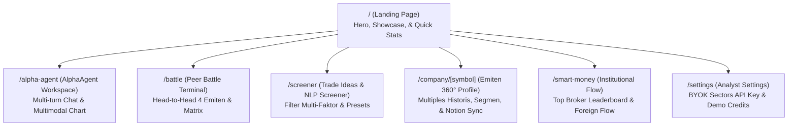

# AlphaSector — Autonomous Financial Agentic AI untuk Pasar Modal Indonesia (IDX)

## 📌 Executive Summary

**AlphaSector** adalah platform *Autonomous Agentic AI* dan terminal riset institusional yang dirancang spesifik untuk ekosistem pasar modal Indonesia (Bursa Efek Indonesia / IDX). Berbeda dari *chatbot generic wrapper* yang hanya membalut prompt di atas LLM publik, AlphaSector mengorkestrasi pipeline multi-step reasoning mandiri, engine kuantitatif deterministik (Piotroski F-Score 9 kriteria dan P/E Historical Standard Deviation Band), pelacakan *smart money* broker flow, serta integrasi ekosistem kerja profesional (1-Click Notion Investment Memo).

Platform ini dibangun untuk menjawab tantangan fragmentasi data keuangan emiten BEI, tingginya barrier analisis fundamental bagi investor ritel maupun analis profesional, serta maraknya noise dan bias spekulatif di media sosial.

---

## 🎯 Track Hackathon & Kualifikasi

- **Track Selection:** **Track 01 — AI Agents & Assistants** (Sectors Hackathon 2026).
- **Core Data Source:** **Sectors Financial API v2** (REST API terstruktur: Laporan keuangan, valuasi historis, segmen bisnis, broker flow, dan klasifikasi IDX-IC).
- **Kepatuhan Regulasi & Rules:**
  - **Zero Automated Trade Execution:** Platform ini murni merupakan *decision-support & research intelligence system*, mematuhi larangan eksekusi order otomatis.
  - **Bukan MCP Client Wrapper Generik:** Seluruh alur orkestrasi, function-calling, state management, dan synthesis berjalan pada backend mandiri milik tim, bukan menumpang pada Claude Desktop atau ChatGPT generic UI.
  - **Disclaimer Eksplisit:** Setiap output analisis menyertakan disclaimer kepatuhan finansial (*"Alat informasi & analisis, bukan rekomendasi investasi"*).

---

## 💡 Masalah yang Diselesaikan (Problem Statements)

1. **Barrier Analisis Fundamental yang Tinggi:**
   Membaca laporan keuangan ratusan halaman IDX-IC memakan waktu berjam-jam dan membingungkan investor pemula. AlphaSector mengekstraksi metrik penting secara instan dalam bahasa natural yang lugas.
2. **Ketiadaan Engine Deterministik pada Chatbot AI Biasa:**
   Model bahasa besar (LLM) terkenal sering berhalusinasi saat menghitung angka rasio finansial. AlphaSector memisahkan tugas komputasi ke **Deterministik Quant Engine** (Python) dan hanya memanfaatkan LLM untuk sintesis naratif riset.
3. **Data Aliran Institusi (*Smart Money*) yang Terfragmentasi:**
   Deteksi akumulasi/distribusi broker (Bandarologi & Foreign Flow) biasanya memerlukan software mahal terpisah. AlphaSector mengintegrasikannya langsung ke dalam alur riset emiten.
4. **Alur Kerja Riset yang Terputus:**
   Setelah analis selesai meriset, mentransfer temuan ke *knowledge base* tim memakan waktu. Fitur **1-Click Notion Sync** langsung mengekspor *Investment Memo* berformat rapi ke workspace tim analis.

---

## 🗺️ Peta Navigasi & Modul Aplikasi

Aplikasi dibangun dengan Next.js 15 App Router dan FastAPI, terdiri dari modul-modul berikut:

| Route | Nama Fitur | Deskripsi Singkat |
|---|---|---|
| [`/`](file:///d:/Projects/Web%20Shi/sectors-hackathon/frontend/app/page.tsx) | **Landing & Product Showcase** | Antarmuka visual interaktif dengan statistik emiten BEI, arsitektur preview, dan value proposition. |
| [`/alpha-agent`](file:///d:/Projects/Web%20Shi/sectors-hackathon/frontend/app/alpha-agent/page.tsx) | **AlphaAgent Workspace** | Terminal multi-turn AI copilot, pengenalan chart teknikal multimodal, *reasoning trace accordion*, dan widget interaktif. |
| [`/battle`](file:///d:/Projects/Web%20Shi/sectors-hackathon/frontend/app/battle/page.tsx) | **Peer Battle Terminal** | Komparasi multi-emiten (hingga 4 emiten sekaligus) dengan penentuan *best-in-class* badge secara matematis. |
| [`/screener`](file:///d:/Projects/Web%20Shi/sectors-hackathon/frontend/app/screener/page.tsx) | **Trade Ideas & Screener** | Penyaringan saham berbasis bahasa natural (NLP) dan preset tematik 1-klik (*Undervalued Titans, Dividend Aristocrats*). |
| [`/company/[symbol]`](file:///d:/Projects/Web%20Shi/sectors-hackathon/frontend/app/company/%5Bsymbol%5D/page.tsx) | **Emiten 360° Profile & Dossier** | Halaman deep-dive komprehensif: valuasi tahunan, kontribusi segmen bisnis, broker summary, dan ekspor dossier. |
| [`/smart-money`](file:///d:/Projects/Web%20Shi/sectors-hackathon/frontend/app/smart-money/page.tsx) | **Institutional Flow Tracker** | Deteksi konsentrasi transaksi broker top 3 (Big Accum/Distrib) dan pergerakan dana asing. |
| [`/settings`](file:///d:/Projects/Web%20Shi/sectors-hackathon/frontend/app/settings/page.tsx) | **Analyst Settings & BYOK** | Pengelolaan personal API key (*Bring Your Own Key*) dengan live latency tester dan pemantauan kuota demo. |

---

## 💻 Tech Stack Ringkas

- **Frontend:** Next.js 15 (App Router), React 19, TypeScript, Vanilla Tailwind CSS (Custom Dark Glassmorphism, Neon Cyan & Emerald Glow), Lucide Icons.
- **Backend & AI:** FastAPI (Python 3.11+), Minimalist Direct-to-API Orchestration (Groq `openai/gpt-oss-120b` untuk grounded synthesis + Google Gemini untuk Multimodal Chart Vision), Pydantic v2, Sectors Financial API v2 REST Client.
- **Database & State:** Dual-Mode Storage Architecture (Production Neon PostgreSQL dengan otomatis fallback ke local SQLite `alphasector.db` untuk 100% clone-and-run out-of-the-box).
- **Ekspor & Integrasi:** Notion API Client (v2.2+ SDK) untuk 1-Click Institutional Investment Memo sync dengan validasi kredensial transparan.
