# AlphaSector — Arsitektur Teknis & Engine Kuantitatif Deterministik

Dokumen ini menjelaskan arsitektur internal, alur orkestrasi agent multi-langkah (*multi-step agentic workflow*), serta modul komputasi kuantitatif deterministik yang menjadi otak di balik platform **AlphaSector**.

---

## 1. 📐 Diagram Alur Orkestrasi Agent Otonom

Sistem tidak mengandalkan satu pemanggilan prompt tunggal. Setiap interaksi pengguna diproses melalui pipeline 5 tahap independen:

```mermaid
sequenceDiagram
    autonumber
    actor User as Pengguna (Analis)
    participant UI as Next.js 15 Frontend
    participant Orch as Agent Orchestrator (FastAPI)
    participant Plan as Planner (LLM Intent Engine)
    participant Tools as Tool Execution Pipeline
    participant Sectors as Sectors Financial API v2
    participant Quant as Deterministic Quant Engine
    participant Synth as Synthesizer (Groq LLM)
    participant DB as Dual DB (Postgres / Local SQLite)

    User->>UI: Input Kueri / Upload Chart
    UI->>Orch: POST /api/agent/query (query, session_id, image)
    Orch->>DB: Ambil Riwayat Percakapan & BYOK Key
    Orch->>Plan: Evaluasi Intent & Ekstraksi Parameter
    Plan-->>Orch: Structured Execution Plan (Target Endpoints & Tickers)
    
    rect rgb(20, 28, 48)
        note right of Orch: Paralel / Targeted Data Fetching
        Orch->>Tools: Eksekusi Tool Calls
        Tools->>Sectors: GET /v2/company/report, /v2/company/top-brokers, dll.
        Sectors-->>Tools: Raw Data Keuangan & Valuasi
        Tools-->>Orch: Structured Financial Payload
    end

    rect rgb(18, 38, 32)
        note right of Orch: Komputasi Deterministik (Python Quant Engine)
        Orch->>Quant: Hitung Piotroski F-Score (9 Kriteria Akuntansi Ketat)
        Orch->>Quant: Hitung P/E Historical Standard Deviation Bands (+/- 2 SD)
        Orch->>Quant: Hitung Peer Gap % & Best-in-Class Badges
        Quant-->>Orch: Computed Quant Metrics
    end

    Orch->>Synth: Sintesis Narasi Riset Fundamental (Data + Quant Metrics)
    Synth-->>Orch: Executive Summary, Katalis, Risiko, & Verdict
    Orch->>DB: Simpan Sesi & Kurangi Kuota Kredit Demo
    Orch-->>UI: Full JSON Response (Synthesis + Quant Widgets + Trace)
    UI-->>User: Render Jawaban Interaktif + Reasoning Accordion
```

---

## 2. 🧠 Modul Pipeline Backend

### A. Intent Planner (`backend/app/agent/planner.py`)
Berbeda dengan pendekatan LLM generik yang lambat dan rentan halusinasi routing, AlphaSector mengadopsi **Deterministic Hybrid Rule-Based & Regex Classifier**. Dengan latensi super cepat (<5ms), Planner membedah kueri pengguna dan mengekstrak kode saham (format 4 huruf IDX) serta parameter numerik (`min_roe`, `max_pe`) secara deterministik ke dalam salah satu dari 5 kategori intent:
1. `SINGLE_COMPANY`: Riset mendalam terhadap 1 emiten spesifik.
2. `PEER_BATTLE`: Komparasi multi-emiten (2-4 emiten).
3. `SCREENER`: Pencarian/penyaringan saham berdasarkan kriteria metrik finansial.
4. `SMART_MONEY`: Analisis broker flow, konsentrasi bandar, atau foreign flow.
5. `GENERAL_INQUIRY`: Edukasi seputar pasar modal Indonesia atau pertanyaan makroekonomi.

Planner mengekstrak kode saham (misal `BBCA`, `TLKM`) serta parameter numerik (`min_roe`, `max_pe`) tanpa membuat asumsi berlebihan.

### B. Tool Execution Engine (`backend/app/agent/tools.py` & `orchestrator.py`)
Menangani pemanggilan data terstruktur ke **Sectors Financial API v2**:
- `/v2/company/report/{symbol}/`: Overview perusahaan, valuasi historis, rasio fundamental.
- `/v2/company/segments/{symbol}/`: Rincian pendapatan per segmen bisnis.
- `/v2/company/top-brokers/{symbol}/`: Ringkasan akumulasi anggota bursa 14 hari perdagangan.
- `/v2/companies/`: Kueri penyaringan emiten dengan klausa `where` dan `order_by` terstruktur.

### C. Synthesizer & Bias Neutralizer (`backend/app/agent/synthesizer.py`)
Bertanggung jawab mengubah data mentah dan hasil komputasi kuantitatif menjadi narasi riset institusional dalam Bahasa Indonesia yang formal dan lugas. Synthesizer diberi batasan ketat (*guardrails*):
- Dilarang merekomendasikan sinyal beli/jual secara mutlak.
- Wajib memisahkan antara fakta data resmi vs interpretasi analitis.
- Selalu menyertakan potensi risiko bisnis (*downside risks*) dan katalis pertumbuhan (*growth catalysts*).

---

## 3. 🔬 Deterministik Financial Quant Engine (`backend/app/agent/financial_engine.py`)

Salah satu inovasi penting dalam AlphaSector adalah **ketiadaan halusinasi matematis**. Seluruh rasio dan skor akuntansi dihitung langsung menggunakan algoritma Python murni:

### A. Piotroski F-Score (9 Kriteria Kesehatan Finansial)
Model evaluasi fundamental 9 poin yang dirancang oleh Prof. Joseph Piotroski untuk menguji kekuatan keuangan emiten:

| Kategori | No | Kriteria Pengujian | Nilai Logika |
|---|:---:|---|:---:|
| **Profitabilitas** | 1 | Laba Bersih Tahun Terakhir > 0 (Net Income Positif) | 1 / 0 |
| | 2 | Arus Kas Operasi (CFO) > 0 | 1 / 0 |
| | 3 | Return on Assets (ROA) Tahun Berjalan > ROA Tahun Sebelumnya | 1 / 0 |
| | 4 | Kualitas Laba: Arus Kas Operasi (CFO) > Laba Bersih | 1 / 0 |
| **Struktur Modal & Likuiditas** | 5 | Penurunan Rasio Utang Jangka Panjang (Long-Term Debt / Total Asset) | 1 / 0 |
| | 6 | Peningkatan Rasio Lancar (Current Ratio Tahun Berjalan > Tahun Lalu) | 1 / 0 |
| | 7 | Tidak Ada Dilusi Saham (Jumlah Lembar Saham Beredar Tidak Bertambah) | 1 / 0 |
| **Efisiensi Operasional** | 8 | Peningkatan Margin Laba Kotor (Gross Margin Tahun Berjalan > Tahun Lalu) | 1 / 0 |
| | 9 | Peningkatan Perputaran Aset (Asset Turnover Tahun Berjalan > Tahun Lalu) | 1 / 0 |
| **Total Skor** | — | **Rentang Nilai: 0 hingga 9** | **Verdict: Strong (7-9), Moderate (4-6), Weak (0-3)** |

### B. P/E Historical Standard Deviation Bands (Mean & Std Dev Valuation)
Menghitung posisi valuasi saham terhadap rata-rata historisnya (3-5 tahun terakhir):
1. **Mean P/E ($\mu$):** Rata-rata rasio Price-to-Earnings selama periode historis.
2. **Standar Deviasi ($\sigma$):** Deviasi standar volatilitas valuasi historis.
3. **Bands Valuasi:**
   - $+2\sigma$: *Extremely Overvalued* (Zona resistensi valuasi ekstrem).
   - $+1\sigma$: *Overvalued* (Valuasi di atas rata-rata wajar).
   - $\text{Mean}$: *Fair Valuation* (Valuasi wajar historis).
   - $-1\sigma$: *Undervalued* (Valuasi murah terdiskon).
   - $-2\sigma$: *Deep Value / Extremely Undervalued* (Zona akumulasi diskon signifikan).
4. **Diskon/Premium (%):** Dihitung secara matematis:
   $$\text{Gap} = \frac{\text{Current P/E} - \text{Mean P/E}}{\text{Mean P/E}} \times 100\%$$

---

## 4. 👁️ Pipeline Multimodal Vision (Analisis Chart Teknikal)

AlphaSector mendukung masukan gambar grafik candlestick atau screenshot broker summary melalui alur berikut:

1. **Frontend Capture:**
   - File picker atau event paste (`clipboardData`) di textarea chat.
   - Kompresi sisi klien ke format Base64 (JPEG/PNG).
2. **Payload Transmission:**
   - Dikirim ke endpoint `/api/agent/query` bersama parameter kueri teks.
3. **Gemini Vision Processing:**
   - Agent memanfaatkan kemampuan visual Google Gemini untuk mendeteksi:
     - Formasi tren harga (Uptrend, Downtrend, Sideways).
     - Garis support dan resistance kunci.
     - Tabel net buy/sell broker jika gambar berupa broker summary.
4. **Sintesis Terpadu:**
   - Hasil pembacaan chart teknikal digabungkan dengan data fundamental Sectors API untuk menghasilkan analisis komprehensif (Fundamental + Teknikal).

---

## 5. 💾 Database & State Management (Dual-Mode Storage Architecture)

AlphaSector mengimplementasikan **Dual-Mode Database Architecture** yang menggabungkan keandalan cloud production dan kemudahan evaluasi lokal:
1. **Primary Production Mode (Neon PostgreSQL):**
   Saat `DATABASE_URL` tersedia, sistem menggunakan pool PostgreSQL Neon Cloud dengan keamanan SSL dan koneksi asinkron terisolasi.
2. **Automatic Local Fallback Mode (SQLite Engine):**
   Jika `DATABASE_URL` tidak didefinisikan atau jaringan eksternal terputus, backend secara otomatis (*seamlessly*) mengalihkan penyimpanan ke database SQLite lokal (`alphasector.db`). Hal ini menjamin evaluator/juri yang menjalankan *clone-and-run* dapat langsung menguji aplikasi tanpa hambatan konfigurasi database eksternal.

Skema entitas yang didukung penuh pada kedua mode:
- `users`: Autentikasi analis, kuota demo credits, dan personal BYOK Sectors Key.
- `chat_sessions`: Metadata sesi percakapan, emiten terkait, dan timestamp.
- `chat_messages`: Riwayat percakapan multi-turn, reasoning trace JSON, dan widget data.
- `sectors_api_cache`: Cache persisten 24 jam untuk optimasi kuota Sectors API.
- `ai_interaction_logs`: Log observabilitas dan audit teknis seluruh inferensi model.
