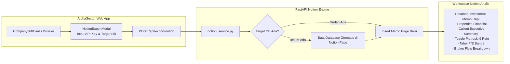

# AlphaSector — Integrasi Ekosistem Eksternal & Notion Sync

Dokumen ini mendokumentasikan integrasi sistem eksternal yang dihubungkan ke dalam **AlphaSector**, dengan sorotan khusus pada fitur **1-Click Notion Sync (Institutional Investment Memo)** dan kepatuhan regulasi ekosistem finansial.

---

## 1. 📝 1-Click Notion Sync (Institutional Investment Memo)

Salah satu kelemahan terbesar riset finansial AI adalah **terputusnya alur kerja analis (*workflow fragmentation*)**. Setelah analis mendapatkan kesimpulan komparasi atau valuasi di dalam aplikasi AI, mereka harus menyalin teks, menata tabel, dan memformat ulang ke alat kolaborasi tim mereka secara manual.

AlphaSector menyelesaikan masalah ini dengan mengintegrasikan **Notion API v2.2+** secara natif untuk mengekspor *Institutional Investment Memo* profesional dalam 1 klik.



### A. Format dan Properti Database Notion
Halaman yang diekspor otomatis memiliki properti terstruktur yang langsung dapat difilter dan disortir oleh komite investasi di Notion:

| Nama Properti | Tipe Properti | Contoh Nilai | Deskripsi |
|---|---|---|---|
| **Ticker** | `title` | `BBCA` | Kode saham emiten |
| **Company Name** | `rich_text` | `Bank Central Asia Tbk` | Nama resmi emiten |
| **Sector** | `select` | `Financials` | Sektor IDX-IC |
| **Sub-Sector** | `select` | `Banks` | Sub-sektor IDX-IC |
| **Market Cap** | `number` | `1,250,000,000,000,000` | Kapitalisasi pasar dalam Rupiah |
| **Last Close Price** | `number` | `10,250` | Harga penutupan terakhir |
| **P/E Ratio** | `number` | `21.4` | Rasio Price to Earnings terkini |
| **PBV Ratio** | `number` | `4.2` | Rasio Price to Book Value |
| **ROE (%)** | `number` | `19.8` | Return on Equity (%) |
| **Piotroski F-Score** | `number` | `8` | Skor kesehatan finansial (0-9) |
| **Valuation Band** | `select` | `UNDERVALUED` / `FAIR` | Status deviasi historis P/E |
| **Smart Money Flow** | `select` | `STRONG_ACCUMULATION` | Fase akumulasi broker bandar |
| **Research Date** | `date` | `2026-09-05` | Tanggal penerbitan memo |

### B. Isi Blok Konten Halaman Notion
Selain properti database, isi halaman diisi dengan blok kaya (*rich blocks*):
1. **Callout Blok Ringkasan Eksekutif:** Penjelasan tesis investasi utama dan rasionalisasi valuasi.
2. **Toggle Blok Piotroski F-Score:** Rincian 9 kriteria akuntansi yang dapat dibuka-tutup untuk memeriksa poin mana saja yang lulus/gagal.
3. **Tabel Deviasi Standar P/E Band:** Angka $+2\sigma$, $+1\sigma$, $\text{Mean}$, $-1\sigma$, dan $-2\sigma$ serta diskon harga saat ini.
4. **Analisis Broker & Foreign Flow:** Rekapitulasi volume transaksi top 3 pembeli dan penjual terbesar 14 hari terakhir.
5. **Callout Kepatuhan Finansial:** Disclaimer resmi bahwa memo ini bersifat *informational research memo* dan bukan perintah eksekusi transaksi.

---

## 2. ⚡ Integrasi Sectors Financial API v2

AlphaSector memanfaatkan REST API resmi dari Sectors Financial sebagai penyedia data pasar modal primer:

```
[User Query / Feature Trigger]
              |
              v
[FastAPI Sectors Client (backend/app/sectors/)]
  |-- GET /v2/companies/?where=...&order_by=... (Screener terstruktur)
  |-- GET /v2/company/report/{symbol}/          (Overview fundamental & multiples)
  |-- GET /v2/company/segments/{symbol}/        (Breakdown pendapatan segmen)
  |-- GET /v2/company/top-brokers/{symbol}/     (Data broker summary & akumulasi)
  |-- GET /v2/most-traded/                      (Likuiditas harian bursa)
```

### Optimasi & Ketahanan Jaringan:
- **Kueri Terstruktur di atas Full-Text Search:** Memprioritaskan endpoint terstruktur `/v2/companies/?where=sub_sector='...'` daripada pencarian bebas, menghasilkan data yang lebih deterministik dan hemat biaya.
- **BYOK Key Fallback:** Menggunakan API Key pribadi analis jika dikonfigurasi di Pengaturan, dan otomatis beralih ke kuota demo bersama jika kunci tidak tersedia.
- **Latency Health Monitoring:** Fitur *Tes Koneksi* di frontend mengukur waktu respons server secara real-time.

---

## 3. 🛡️ Kepatuhan Regulasi, Keamanan & Responsible AI

AlphaSector dirancang dengan kepatuhan ketat terhadap aturan kompetisi dan regulasi pasar modal:

1. **Larangan Eksekusi Otomatis (No Automated Trade Execution):**
   Aplikasi ini **TIDAK** terhubung ke gateway order broker (FIX protocol, auto-trading API sekuritas). Hal ini disengaja agar sistem berfungsi murni sebagai alat bantu riset analitik dan mematuhi etika pasar modal tanpa risiko manipulasi pasar.
2. **Isolasi Kunci Pribadi (BYOK Isolation):**
   Kunci API Sectors dan Notion yang dimasukkan oleh pengguna dienkripsi dan diisolasi per akun pengguna. Kunci tersebut tidak dibagikan ke pengguna lain ataupun dicatat di log publik.
3. **Disclaimer Finansial Konsisten:**
   Setiap hasil analisis di antarmuka web, file export dossier, maupun halaman Notion menyertakan penafian hukum:
   > *"AlphaSector adalah platform analisis dan kecerdasan pasar modal independen. Seluruh konten, matriks komparasi, dan estimasi valuasi disajikan untuk tujuan riset dan edukasi, bukan merupakan ajakan atau rekomendasi beli/jual instrumen keuangan tertentu."*
