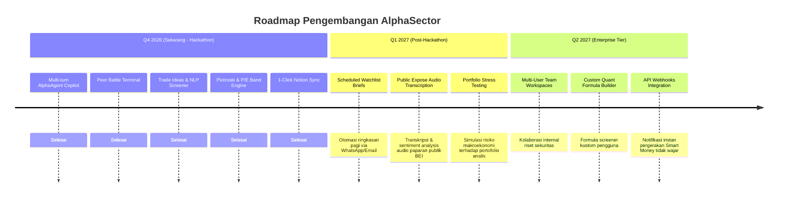

# AlphaSector — Keunggulan Kompetitif & Roadmap Pengembangan

Dokumen ini membedah posisi pasar, keunggulan kompetitif dibandingkan solusi yang ada, keselarasan dengan kriteria penjurian **Track 01 (AI Agents & Assistants)**, serta arah pengembangan (*roadmap*) ke depan.

---

## 1. ⚔️ Matriks Perbandingan Kompetitif

| Dimensi Fitur | Chatbot Generik (ChatGPT / Claude Desktop + MCP) | Aplikasi Saham Tradisional (Stockbit / RTI / Ajaib) | **AlphaSector (Autonomous Agent)** |
|---|---|---|---|
| **Konteks Lokal IDX-IC** | Rendah (sering tertukar standar US SEC) | Tinggi (data lengkap pasar Indonesia) | **Tinggi & Otentik** (Klasifikasi IDX-IC resmi via Sectors API) |
| **Kalkulasi Deterministik** | Buruk (sering halusinasi angka & rasio) | Baik (angka statis kalkulasi server) | **Akurat & Transparan** (Piotroski 9-Poin & P/E Bands dihitung via Python Engine) |
| **Reasoning Multi-Langkah** | Terbatas pada jendela percakapan | Tidak ada fitur reasoning | **Tinggi** (Planner $\rightarrow$ Tools $\rightarrow$ Quant $\rightarrow$ Synthesizer dengan trace transparan) |
| **Penyusunan Tesis Otomatis** | Umum dan bertele-tele | Manual oleh pengguna | **Naratif Institusional** (Eksekutif summary, katalis, risiko bisnis) |
| **Analisis Visual Chart & Broker**| Hanya mengenali gambar umum | Grafik teknikal interaktif | **Multimodal Vision** (Membaca pola chart dan broker summary terpadu) |
| **Alur Ekspor Kolaborasi Tim** | Manual salin-tempel | Screenshot statis | **1-Click Notion Sync** (Lengkap dengan properti database, toggle, & callout) |
| **Kemandirian Aplikasi** | Menumpang di client pihak ketiga | Berdiri sendiri | **Purpose-Built Web App** (Next.js 15 UI terisolasi, bukan MCP client wrapper) |

---

## 2. 🏆 Keselarasan dengan Kriteria Penjurian Track 01

Aturan Sectors Hackathon 2026 secara eksplisit melarang aplikasi yang *"hanya berupa client AI generik yang dipasangi Sectors MCP dengan system prompt"*.

Berikut adalah bukti konkret bahwa **AlphaSector** memenuhi dan melampaui kualifikasi Track 01:

1. **Multi-Step Autonomous Workflow Milik Sendiri:**
   Orkestrasi agen sepenuhnya ditulis dalam kode backend tim (`orchestrator.py`, `planner.py`, `synthesizer.py`), memproses kueri melalui perencanaan langkah, eksekusi paralel alat, komputasi kuantitatif, dan sintesis akhir.
2. **Deterministik Quantitative Engine:**
   Sistem tidak mengandalkan LLM untuk menjumlahkan atau memperkirakan angka rasio. Model akuntansi Piotroski F-Score dan deviasi standar P/E dieksekusi secara matematis oleh algoritma Python sebelum diserahkan ke synthesizer.
3. **Purpose-Built Financial Interface:**
   Antarmuka dibangun khusus untuk kebutuhan investor dan analis saham Indonesia:
   - Terminal obrolan dengan *Reasoning Trace Accordion* (milidetik latensi & konsumsi kredit).
   - Tabel komparasi *Peer Battle* dengan lencana *Best-in-Class* dinamis.
   - *Floating Dock* screener untuk peluncuran battle instan.
4. **State Management & Memory Mandiri:**
   Riwayat percakapan multi-turn, kluster logo emiten, data sesi, serta kuota kredit disimpan di database SQLite backend mandiri, independen dari platform pihak ketiga.

---

## 3. 🚀 Roadmap Pengembangan Masa Depan

Meskipun aplikasi saat ini sudah berfungsi penuh (*fully functional MVP+*), berikut adalah roadmap jangka menengah untuk pengembangan komersial AlphaSector:

### Rincian Modul Mendatang:
1. **Scheduled Watchlist Intelligence Brief:**
   Fungsi background scheduler (cron) yang memindai pergerakan keterbukaan informasi dan laporan keuangan baru setiap hari untuk seluruh emiten di watchlist analis, lalu mengirimkan ringkasan ringkas sebelum jam bursa dibuka (08:30 WIB).
2. **Audio Public Expose Intelligence:**
   Menggunakan model Speech-to-Text untuk menyimak rekaman *Public Expose* manajemen emiten di kanal YouTube resmi IDX, lalu menganalisis nada bicara (*tone of voice*), optimisme manajemen, dan komitmen target pendapatan tahun mendatang.
3. **Portfolio Risk Stress Testing:**
   Memungkinkan analis mengunggah alokasi portofolio mereka untuk menguji ketahanan terhadap skenario ekstrem (misal: pelemahan Rupiah terhadap USD, kenaikan suku bunga BI-Rate, atau fluktuasi harga komoditas batu bara/nikel).
