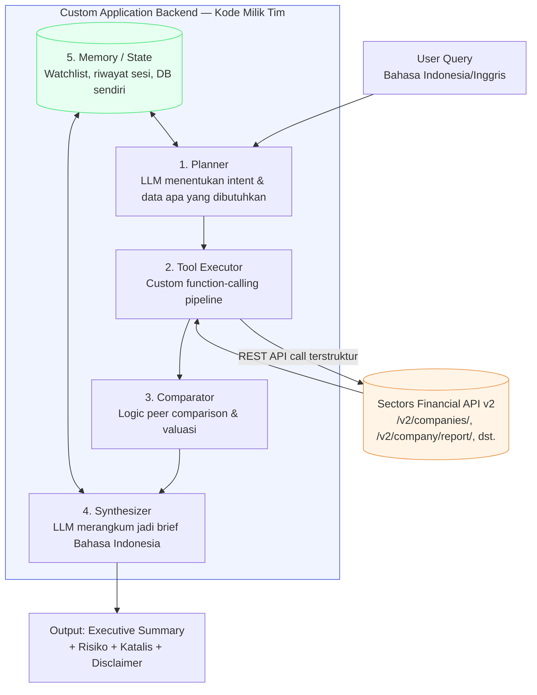

# Outline Rancangan Aplikasi — Sectors Hackathon 2026

**Track:** 01 — AI Agents & Assistants
**Nama kerja (working title):** Analis Riset Otonom *(bisa diganti sebelum submission)*

---

## 1. Problem Statement

Satu kalimat untuk submission:
> "Membantu investor ritel dan analis di Indonesia melakukan riset fundamental emiten IDX secara cepat dan terstruktur, tanpa harus membaca laporan keuangan mentah atau membandingkan data secara manual antar sumber."

Masalah yang ditangani (dari analisis awal):
1. Barrier analisis fundamental tinggi bagi investor ritel
2. Informasi pasar yang terfragmentasi (laporan, tren sektor, dividen, aksi korporasi)
3. Riset manual yang time-intensive untuk profesional (peer comparison, valuasi, brief harian)
4. Overload informasi & bias sentimen di media sosial
5. Kurangnya konteks lokal (klasifikasi IDX-IC, Bahasa Indonesia) di tools finansial global

---

## 2. Kenapa Ini Qualify untuk Track 01 (bukan "does not qualify")

Poin kritis dari rules: produk **tidak boleh** hanya berupa client AI generik (Claude Desktop, ChatGPT, dll) yang disambungkan ke Sectors MCP dengan system prompt. Produk harus tetap berfungsi walau dilepas dari client pihak ketiga manapun.

**Cara outline ini menghindari jebakan tersebut:**

| Syarat "what qualifies" | Implementasi di outline ini |
|---|---|
| Multi-step reasoning flow | Alur Planner → Tool Executor → Comparator → Synthesizer (lihat diagram §4) |
| Custom tool-use pipeline | Kode sendiri yang memanggil Sectors REST API secara terstruktur (bukan lewat MCP di client orang lain) |
| Routing antar sumber data | Planner memilih endpoint mana yang relevan berdasarkan jenis pertanyaan |
| Memory / state management | Riwayat watchlist & sesi analisis disimpan di database aplikasi sendiri |
| Purpose-built interface | Web app sendiri (bukan jendela chat generik) untuk use-case investor/analis Indonesia |

Konsekuensinya: **agent orchestration-nya WAJIB berupa kode aplikasi milik tim**, dijalankan lewat pemanggilan langsung ke LLM API (mis. Anthropic API) + Sectors REST API. MCP Server Sectors boleh dipakai sebagai referensi tool-schema, tapi eksekusi & reasoning tetap di backend sendiri — bukan diserahkan ke Claude Desktop/ChatGPT sebagai client.

---

## 3. Fitur Utama (dipetakan ke masalah)

| Fitur | Masalah yang dijawab | Endpoint Sectors terkait |
|---|---|---|
| Query emiten/sektor bahasa natural | #1, #5 | `/v2/companies/` (structured `where`/`order_by`, prioritaskan ini di atas `?q=` karena lebih murah & menunjukkan logic sendiri) |
| Peer comparison otomatis dalam satu sub-sektor | #2, #3 | `/v2/companies/?where=sub_sector='...'`, `/v2/company/report/{symbol}/` |
| Ringkasan eksekutif + risiko + katalis | #1, #4 | Hasil sintesis dari beberapa endpoint di atas |
| Daily/periodic brief untuk watchlist | #3 | Dijadwalkan (cron) memanggil ulang pipeline yang sama |
| Disclaimer eksplisit "alat analisis, bukan rekomendasi" | Code of conduct (wajib) | — |

---

## 4. Diagram Arsitektur

**Catatan penting untuk video judging:** highlight kotak "Custom Application Backend" secara eksplisit di walkthrough — ini bagian yang membuktikan produk bukan sekadar prompt di atas client generik. Tunjukkan kode Planner dan Tool Executor di repository saat demo.

---

## 5. Tech Stack (Usulan)

- **Backend/orkestrasi:** Python (FastAPI) atau Node.js (Next.js API routes) — agent logic ditulis manual atau pakai framework seperti LangChain/CrewAI untuk struktur, tapi konfigurasi tool tetap custom
- **LLM:** Anthropic API atau Google Gemini API (function calling langsung, bukan lewat MCP client pihak ketiga)
- **Data source:** Sectors Financial API v2 (REST, structured `where`/`order_by` query diprioritaskan)
- **Frontend:** Next.js / Streamlit — purpose-built UI untuk use-case investor Indonesia
- **Storage/memory:** Database ringan (SQLite/Postgres) untuk watchlist & riwayat sesi

---

## 6. Batasan yang Wajib Dipatuhi

- Tidak ada eksekusi order beli/jual otomatis (automated trade execution dilarang di semua track)
- Semua output harus punya disclaimer "alat informasi & analisis, bukan rekomendasi investasi"
- Repository baru dibuat setelah 19 Agustus 2026; commit pertama menandai mulainya build period
- Sectors data harus jadi core function — kalau data Sectors dicabut, produk kehilangan fungsi utamanya (bukan sekadar hiasan)

---

## 7. Cakupan MVP untuk Build Period

**Wajib ada (minimum untuk lolos eligibility "product works"):**
- [ ] Planner sederhana: klasifikasi intent user (screening / perbandingan / ringkasan satu emiten)
- [ ] Tool executor: minimal 2 endpoint Sectors terhubung dengan pipeline sendiri
- [ ] Synthesizer: output ringkasan Bahasa Indonesia yang koheren
- [ ] Disclaimer di setiap output

**Nice-to-have kalau waktu cukup:**
- [ ] Memory lintas sesi (watchlist tersimpan)
- [ ] Daily brief terjadwal
- [ ] Grounding check (pisahkan klaim dari data Sectors vs interpretasi LLM)

---

## 8. Catatan Submission

- Video teaser (1 menit) & video judging (3 menit): tunjukkan alur Planner → Tool Executor → Synthesizer secara visual, bukan cuma hasil akhir
- Repository: pastikan kode orkestrasi (bukan cuma pemanggilan API) terlihat jelas di commit history
- Cantumkan track selection: **AI Agents & Assistants**
