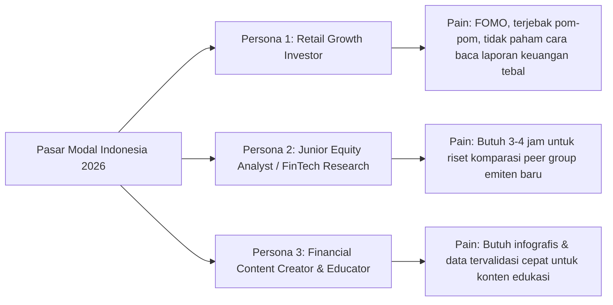

# 🚀 SektorIQ (Analis Riset Otonom IDX) — Product Concept & Positioning

**Track:** 01 — AI Agents & Assistants  
**Slogan:** *Autonomous Equity Research Copilot for the Indonesian Stock Market*

---

## 1. Executive Summary & One-Sentence Pitch

> **Submission Problem Statement:**  
> *"Memberdayakan investor ritel dan analis pasar modal Indonesia dengan AI Research Copilot otonom yang merencanakan, mengambil, membandingkan data fundamental, valuasi, dan aliran dana broker (*smart money*) IDX secara instan tanpa perlu menganalisis laporan keuangan mentah secara manual."*

---

## 2. Target User Personas & Pain Points

### 🧑‍💼 Persona 1: Investor Ritel & Swasembada Finansial
* **Profil:** Investor individu yang ingin berinvestasi berbasis nilai (*value/growth investing*), namun memiliki waktu terbatas dan kesulitan membaca laporan keuangan PDF ratusan halaman.
* **Solusi SektorIQ:** Tanya dalam bahasa santai/Indonesia, dapatkan laporan komprehensif dalam 5 detik dengan visualisasi metrik kunci dan bahasa manusia yang mudah dipahami.

### 💼 Persona 2: Junior Equity Analyst & Riset Sekuritas
* **Profil:** Analis yang bertugas menyusun *initiation report*, membandingkan rasio valuasi perbankan/komoditas, dan melacak pergerakan akumulasi broker asing.
* **Solusi SektorIQ:** Otomasi *peer comparison matrix*, estimasi valuasi wajar, dan analisis *Smart Money Flow* yang siap diekspor ke PDF/Markdown briefing.

### 📱 Persona 3: Edukator & Kreator Finansial
* **Profil:** Pembuat konten finansial yang butuh data fundamental akurat dan terverifikasi untuk membahas tren sektor (misal: laba emiten nikel vs batubara).
* **Solusi SektorIQ:** Menyediakan data fact-grounded langsung dari Sectors API dengan kutipan sumber yang transparan.

---

## 3. Competitive Advantage vs Alternatif yang Ada

| Fitur / Parameter | SektorIQ (Produk Kita) | Generic ChatGPT / Claude | Bloomberg / Refinitiv | Portal Saham Lokal (RTI/Stockbit) |
|---|---|---|---|---|
| **Konteks Lokal IDX & Bahasa** | 🟢 **Native IDX-IC & Bahasa Indonesia** | 🟡 Sering halusinasi emiten & data basi | 🟢 Kuat, tapi UI rumit & harga mahal ($24k/thn) | 🟢 Kuat data, tapi tidak ada AI agent otonom |
| **Multi-Step Agent Reasoning** | 🟢 **Planner, Comparator, Synthesizer** | 🔴 Single-turn text prediction | 🔴 Manual filter | 🔴 Manual filter & tab switching |
| **Aliran Smart Money (Broker Flow)** | 🟢 **Terintegrasi (Top Accumulation & Net Foreign)** | 🔴 Tidak ada akses data broker BEI | 🟡 Ada, tapi kompleks | 🟡 Ada, tapi tidak ada interpretasi naratif |
| **Transparansi Step Reasoning** | 🟢 **Live Execution Graph di UI** | 🔴 Blackbox | ⚪ N/A | ⚪ N/A |
| **Biaya & Aksesibilitas** | 🟢 **Ringan, Web-based, Cepat** | 🟡 Butuh subscription & custom prompt | 🔴 Sangat mahal untuk ritel | 🟡 Butuh langganan pro |

---

## 4. Why This Wins Track 01 (Passing the Qualifying Bar)

Sesuai aturan Track 01 pada `ai-track-guideline.md`:
> *"The project must include custom-built agent logic or orchestration. The team must build something of its own around the model—not only connect an existing client to Sectors."*

1. **Bukan Wrapper MCP Pihak Ketiga:** Orkestrasi dibangun di kode aplikasi backend sendiri (bukan lewat Claude Desktop atau ChatGPT custom GPTs).
2. **Deterministic Data Pipeline:** Menggabungkan reasoning dinamis LLM dengan kalkulasi kuantitatif deterministik (*peer ranking, financial ratio math, broker flow delta*).
3. **Fact Grounding & Hallucination Guardrail:** Semua angka yang dikutip dalam narasi ditandai dan di-verifikasi silang (*cross-referenced*) dengan payload JSON mentah dari Sectors API.
4. **Purpose-Built Workspace UI:** Antarmuka khusus analisis saham Indonesia dengan command palette (⌘K), kartu metrik, chart perbandingan, dan linimasa reasoning agent.
