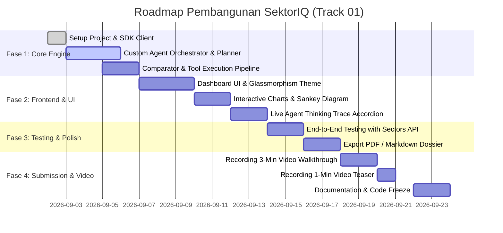

# 🗺️ Implementation Roadmap & Action Plan

Panduan langkah demi langkah (*step-by-step roadmap*) untuk membangun, memverifikasi, dan menyelesaikan proyek hackathon **SektorIQ** sebelum batas waktu submission (30 September 2026).

---

## 📅 Roadmap Pelaksanaan

---

## 📋 Checklist Eksekusi per Fase

### ✅ Fase 1: Backend Agent Engine (Fondasi Track 01)
- [x] Eksplorasi API Sectors v2 & pembuatan client wrapper (`exploration/scripts/sectors_client.py`).
- [ ] Implementasi `lib/agent/planner.ts` (klasifikasi intent & pembuatan langkah eksekusi).
- [ ] Implementasi `lib/agent/tools.ts` (pemanggilan REST API Sectors terstruktur).
- [ ] Implementasi `lib/agent/comparator.ts` (kalkulasi kuantitatif rasio & ranking).
- [ ] Implementasi `lib/agent/synthesizer.ts` (sintesis LLM Bahasa Indonesia berdasar fakta).

### 🎨 Fase 2: Modern Frontend & Visualisasi Interaktif
- [ ] Inisialisasi Next.js 14/15 App Router dengan Tailwind CSS dark mode.
- [ ] Komponen **Command Palette (⌘K)** & Input Prompt.
- [ ] Komponen **Live Agent Thinking Trace** (menampilkan langkah eksekusi agent).
- [ ] Komponen **Emiten 360° Card** & **Peer Battle Comparison Matrix**.
- [ ] Komponen **Sankey Revenue Flow** & **Broker Accumulation Chart**.

### 🧪 Fase 3: Pengujian & Refinement
- [ ] Validasi penanganan error (ticker tidak valid, data kosong, batas kredit).
- [ ] Penambahan disclaimer finansial wajib pada setiap output.
- [ ] Pembuatan fitur export ringkasan ke PDF/Markdown.

### 🎥 Fase 4: Video & Final Submission
- [ ] Rekam video judging 3 menit sesuai storyboard di `05_ui_ux_design_and_storytelling.md`.
- [ ] Rekam video teaser 1 menit untuk media sosial.
- [ ] Upload video ke YouTube (Public / Unlisted) atau Google Drive.
- [ ] Buat postingan media sosial dan tag `@sectorsapp`.
- [ ] Pastikan tidak ada API Key yang tersimpan di commit publik GitHub.
- [ ] Submit melalui portal resmi sebelum deadline.
