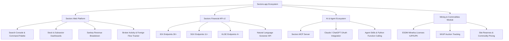

# 🌐 Sectors.app Platform Overview & Architecture

## 1. Apa itu Sectors.app?
**Sectors** (`https://sectors.app`) adalah platform intelijen data keuangan dan API pasar modal terdepan untuk bursa efek Asia Tenggara, dengan fokus utama pada **Bursa Efek Indonesia (IDX / BEI)**, serta ekspansi ke **Singapore Exchange (SGX)**, **Bursa Malaysia (KLSE)**, dan modul khusus **Indonesian Mining & Commodities Intelligence**.

Platform ini menggabungkan data fundamental perusahaan, histori harga transaksi, komposisi kepemilikan saham, aksi korporasi, aktivitas broker & *foreign flow*, berita pasar, lelang tambang Minerba ESDM, hingga *natural language stock screener* bertenaga LLM/RAG.

---

## 2. Ekosistem Produk Sectors



### 1️⃣ Sectors Web Platform & UI
* **Search Console (Command Palette):** Mesin pencari keuangan cepat yang menyatukan pencarian perusahaan, relasi grup konglomerat, kepemilikan modal, berita real-time, dan watchlist.
* **Financial & Revenue Visualization:** Visualisasi laporan keuangan interaktif termasuk diagram alir **Sankey** untuk melihat sumber pendapatan (*revenue segments*) dan beban biaya perusahaan.
* **Broker & Foreign Flow Analytics:** Analisis akumulasi dan distribusi broker harian, pergerakan dana asing (*net foreign inflow*), dan ringkasan broker per emiten.

### 2️⃣ Sectors Financial API (v2)
* **Base URL:** `https://api.sectors.app/v2/`
* **Format:** JSON RESTful API.
* **Authentication:** Menggunakan header API Key:
  ```http
  Authorization: <YOUR_SECTORS_API_KEY>
  ```
* **Kategori Endpoint:**
  * **Indonesia (IDX):** Screener, Helper Lists, Company Reports, Subsector Reports, Transactions, Rankings, IPO & Corporate Actions, News, Suspensions, Broker Flow.
  * **Singapore (SGX):** Company Screener, Share Buybacks, Short Sell, Company Report, News & Filings.
  * **Malaysia (KLSE):** Sectors, Company List, Top Rankings, Company Reports.
  * **Mining Extension:** Mining Companies, Financials & Reserves, Commodity Prices & Export Destinations, Mining Sites, Contracts, ESDM License Auctions.

### 3️⃣ Sectors for AI & Agents
* **MCP (Model Context Protocol) Server:** Tersedia untuk menghubungkan langsung Sectors API dengan Cursor, Claude Desktop, Antigravity, dan AI Agent lainnya.
* **Natural Language Query (`q` parameter):** Endpoint screener `/v2/companies/?q=...` menerima bahasa alami (Inggris atau Indonesia) dan otomatis menerjemahkannya ke filter SQL-like query menggunakan proprietary RAG model.
* **Agent Skills & Recipes:** Panduan integrasi multi-agent, ReAct agents, dan human-in-the-loop stock analysis framework.

---

## 3. Sistem Kuota & Billing (Credits)

Sectors menerapkan sistem kuota berbasis kredit per panggilan API yang dipetakan berdasarkan status kode HTTP:

| HTTP Status | Keterangan | Konsumsi Kredit |
|---|---|---|
| **`2xx` (Success)** | Request berhasil dan data dikembalikan | Sesuai tarif endpoint (sebagian besar **1 kredit**, multi-section / multi-ranking / feeds tertentu lebih) |
| **`404` (Not Found)** | Format request valid, namun resource tidak ditemukan (misal: ticker salah) | **1 kredit** (biaya pemrosesan lookup) |
| **`400` (Bad Request)** | Parameter tidak valid / format salah sebelum dieksekusi | **GRATIS (0 kredit)** |
| **`400` on `?q=` (NL Screener)** | Query bahasa alami gagal setelah diproses oleh LLM model | **1 kredit** (mengganti biaya model LLM) |
| **`401 / 403` (Auth Error)** | API key salah / tidak berizin | **GRATIS (0 kredit)** |
| **`429` (Rate Limit)** | Quota habis / throttling | **GRATIS (0 kredit)** |
| **`5xx` (Server Error)** | Kendala internal server Sectors | **GRATIS (0 kredit)** |

> **Catatan Penting:** 
> - Request list/filter yang mengembalikan hasil kosong (0 item) tetap dianggap sukses `200` dengan array `[]` dan mengonsumsi kredit.
> - Structured query screener (`where`, `order_by`) berbiaya **1 kredit**, sedangkan query natural language (`?q=...`) berbiaya **3 kredit**.

---

## 4. Struktur Dataset & Fitur Utama

| Area | Cakupan Data | Contoh Ticker/Entity |
|---|---|---|
| **IDX Saham** | 900+ Perusahaan tercatat di BEI | `BBCA`, `BBRI`, `TLKM`, `ASII`, `BREN` |
| **IDX Broker** | Broker exchange members (Foreign & Domestic) | `YP`, `CC`, `MG`, `AK`, `PD`, `NI` |
| **SGX Saham** | Emiten Bursa Singapura | `D05` (DBS), `U11` (UOB), `Z74` (Singtel) |
| **KLSE Saham** | Emiten Bursa Malaysia | `1155` (Maybank), `5225` (IHH Healthcare) |
| **Komoditas & Tambang** | Batubara, Nikel, Emas, Tembaga, Timah, Bauksit, WIUP Auctions, IUP/IUPK | Batubara (ICI), Nikel (LME/HBA), WIUP ESDM |

---

## 5. Sumber Daya & Link Dokumentasi
* **Dokumentasi Resmi:** [docs.sectors.app](https://docs.sectors.app)
* **OpenAPI Schema (JSON):** [schema.json](https://docs.sectors.app/schema.json)
* **LLM Index Guide:** [llms.txt](https://docs.sectors.app/llms.txt)
* **Discord Community:** [discord.com/invite/TAnZMmNS4X](https://discord.com/invite/TAnZMmNS4X)
